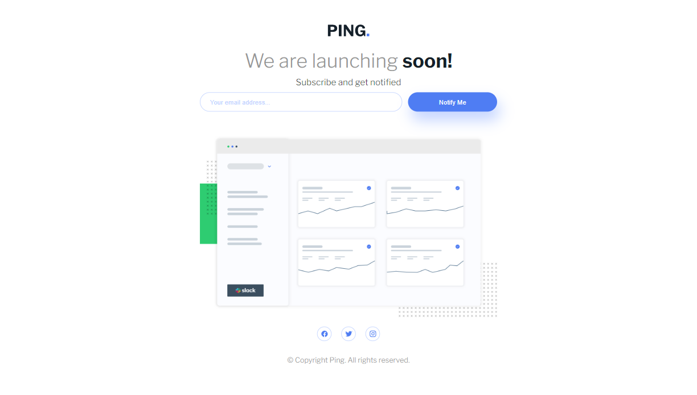
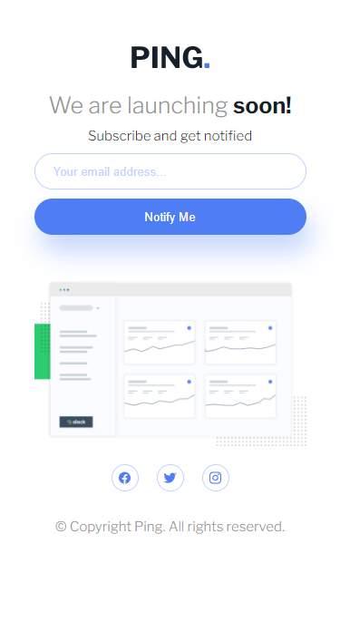

# Ping Coming Soon Page

This is my solution to the [Frontend Mentor Ping Coming Soon Page challenge](https://www.frontendmentor.io/challenges/ping-coming-soon-page-8JqbgoU62) using ReactJS.

## Table of Contents

- [Overview](#overview)
  - [Screenshot](#screenshot)
  - [Links](#links)
- [Features](#features)
- [Technologies](#technologies)
- [Setup](#setup)
- [Usage](#usage)
- [Acknowledgements](#acknowledgements)
- [Credits](#credits)

## Overview

This  project is a responsive coming soon  page for a fictional app caled Ping, that includes a subscription form with email validation and a success toast notification. 

### Screenshot

|  |  |
| ------------------------------ | ----------------------------- |
| Desktop version                | Mobile version                |

### Links

- [View the live site](https://hatemhenchir.github.io/ping-coming-soon-page/)
- [View the Frontend Mentor challenge](https://www.frontendmentor.io/challenges/ping-coming-soon-page-8JqbgoU62)

## Features

- Newsletter sign-up form with email validation
- Toast notification when email is successfully submitted
- Responsive design for desktop, tablet, and mobile screens

## Technologies

- ReactJS
- HTML/CSS
- React Toastify library for toast notifications

## Setup

1. Clone the repository.
2. Run `npm install` to install the project dependencies.
3. Run `npm start` to start the development server.
4. Open `http://localhost:3000` in your web browser to view the project.

## Usage

1. Enter a valid email address in the newsletter sign-up form.
2. Click the "Notify Me" button.
3. A toast notification will appear if the email is valid and submitted successfully.

## Acknowledgements

I would like to thank Frontend Mentor for providing this challenge and the React Toastify library for making it easy to implement toast notifications in React.

## Credits

Design inspiration and assets provided by [Frontend Mentor](https://www.frontendmentor.io/)
- My LinkedIn: [@hatem-henchir-7a92141a8](https://www.linkedin.com/in/hatem-henchir-7a92141a8/)
- My Frontend Mentor: [@hatemhenchir](https://www.frontendmentor.io/profile/hatemhenchir)
